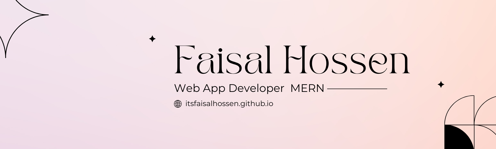

  

 
  
  
  

<h3 align="center">Frontend-Focused Full Stack Web Developer (MERN)</h3>

---

## 🚀 About Me

I'm a passionate **MERN Stack Developer** based in **Dhaka, Bangladesh**.  
I love building dynamic, scalable, and user-friendly web applications.  
I enjoy solving complex problems, creating clean UI/UX, and developing fast, secure, and reliable backend APIs.

### 🎯 My Goals

- Become a **Professional Frontend Web Developer**
- Build visually appealing and highly functional web applications
- Grow as a **full-stack capable (MERN) developer**

---

## 🛠️ Tech Stack & Tools

### 🧰 Tools

### ⚙️ Backend

### 🎨 Frontend

---

### 📚 Currently Learning

---

## 🔧 Technologies I Work With

  
  
  
  
  
  

---

## 💬 Let's Connect

📧 **Email:** [itsfaisalhossen@gmail.com](mailto:itsfaisalhossen@gmail.com)  
🔗 **LinkedIn:** https://linkedin.com/in/itsfaisalhossen  
📘 **Facebook:** https://facebook.com/itsfaisalhossen  
🌐 **Portfolio:** https://itsfaisalhossen.github.io/portfolio/

---

 

  

<h2 align="center">💖 Support Me</h2>

  If you like my work, consider giving a ⭐ to my repositories or connecting with me.

🔥 Thank You for Visiting My Profile

